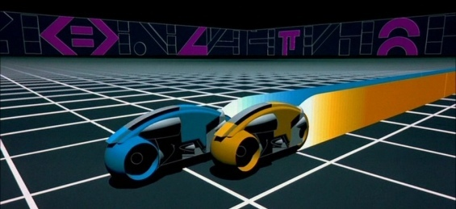
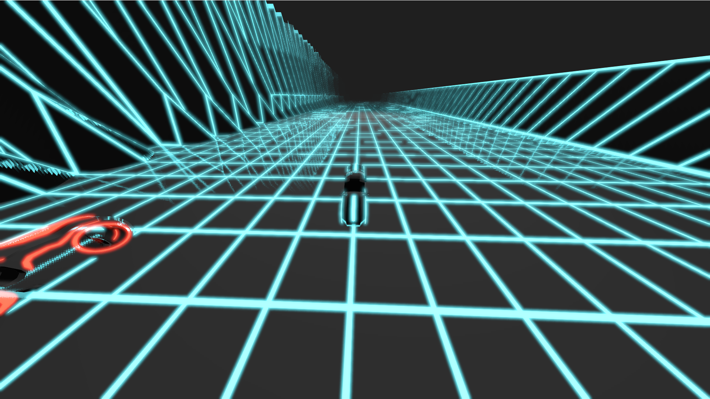

# Trön Racing

**Trön Racing** is the prototype of a video game, which was designed as a project accompanying the lecture *Introduction to Computer Graphics and Visualization* during the summer semester 2021. It was developed in independent work over a period of 6 weeks.

Trön Racing was submitted as part of the Computer [Animation Festival 2021](https://www.youtube.com/playlist?list=PLBQN9Lxu5Q5_MPKG6SQYKbXw6MOEEEJBe).

## Demonstration

[](https://www.youtube.com/watch?v=pUJhhdyEusw)
**Click the image to play video.**

## Approach

To begin with, a rough artistic as well as a technical concept was conceived, which formed the basis for the implementation.

The most important source of inspiration for this project is the movie series *Tron* by Disney, both the original from 1982, which is still celebrated as a milestone in the history of Computer Graphics and its successor *Tron: Legacy*, which is a much more modern and visually appealing realization of the same ideas. The setting of *The Grid* with moving *bikes* combines the possibilities of a simple and reliable design, as it was already possible in 1982, as well as a sophisticated complex scenery. The glowing elements and the potential of fast movements in the setting turned out to be well suited for this project.



## Implementation

At the beginning it was planned to develop a computer game with a steerable bike. The game should be introduced by a tracking shot and an animation, in which the environment and the gameplay are introduced in the basic features. For this purpose, an already driving blue bike should be shown from above. After a downward movement of the camera, some red bikes would approach from behind and enter the picture in a sideways view. Thus, the central blue bike that the player is supposed to identify with here would already be known, as well as the game's enemies. As can be seen in the final gameplay video, the idea of the introductory camera movement and animation was eventually discarded in order to focus more on other aspects that can also already be seen in the gameplay.

### Deferred Rendering Pipeline

In addition to the normal and the depth (from which the position can finally be reconstructed), the diffuse color, the specularity, the emitted color (for all emitting elements in the Tron setting) and a value for the shininess are stored for each fragment. Shininess is used in lighting and from it is also linearly decoded a Metallicness that determines the intensity of reflections.

In HDR Bloom Pass, the stored emitting texture is used. This is smeared alternately horizontally and vertically with the help of a Gaussian kernel, so that the Bloom-typical blurring effect is created. The linear separability of such a kernel is used for optimization.

The result is fed together with the data from the GBuffer into the Lighting Pass, where the scene in the viewspace is calculated for each light. Since blending the results caused problems, this is not used in the delivered video. Finally, the Screenspace Reflections are added and post-processing is performed.

### The Grid

At the beginning of the development the grid was drawn using GL_LINES. This could be implemented with procedural generation of vertices and clever indexing with some for loops, so that a square grid of arbitrary size was created. This already showed the biggest problem of such a grid with all parallel thin lines: Aliasing.

To counteract this, several anti-aliasing techniques were tested. Multisampling turned out to be a big challenge, as it was not compatible with the deferred rendering approach. Then, after apparently successfully applying multisampling, differences in the 1-pixel-wide lines showed up, but the result was still affected by aliasing. So FXAA was additionally implemented, which was not successful either.

Finally, the widening of the lines and a gradient descent towards the edge of the grid lines was a first solution. In the course of this, the implementation using GL_LINES was discarded and the grid was instead mapped as a procedural texture onto a surface. This meant that a vertex must be added at each corner, but also that the height is irrelevant if longitude and latitude coordinates are used in the mapping.

An algorithm that implements this directly in the fragment shader:

```c++
const float edge_width = 1.0 / 32.0;

// grid.coord = position.xy;
vec2 uv = mod(grid_coord + edge_width, 1.0) - mod(grid_coord - edge_width, 1.0) - 2.0 * edge_width;
diffuse = vec3(tron_color * clamp(length(uv), 0.0, 1.0);
```



For coordinates that lie on the grid, the value is -1 (and a vector length of 1 for a grid edge or sqrt(2) for a grid corner) and 0 otherwise. Now an arbitrary 3D world could be designed in Blender with a grid look, as long as only integer xy coordinates are used.

In the end, however, after much research, an even better solution was found, which uses screen-space partial derivatives:
[Anti-Aliased Grid Shader](http://madebyevan.com/shaders/grid/).

### Bikes

The bike model was not designed by the artist. When loading the bike data, it became apparent that no texture was needed, but different materials were used to give the parts of the bike different properties. This was implemented in a custom shader for the bikes so that these materials are passed information so that parts of the bike glow and other parts appear black and smoothly reflective, while the main frame, is somewhat duller and gray. If necessary, the bikes can be colored Tron-typical red or blue. The light tail of the Tron bikes should be implemented through procedural geometries, using the last position of the bike to attach a square to a chain. However, there was no more time for this feature.

### Interaction

To control the bike, a simple speed model was constructed. This takes into account acceleration by holding, automatic deceleration and steering by inclination.

```c++
GLvoid moto::updateMoto() {
    state->translate += glm::vec3(slide_speed * state->y_rotation_angle / max_angle, move_speed * state->speed / max_speed, 0.0);

    // Borders
    if (state->translate.x >= 9.5) state->translate.x = 9.5;
    if (state->translate.x <= -9.5) state->translate.x = -9.5;

    // Reset loop
    if (state->translate.y >= 200.0) state->translate.y -= 200.0;

    state->speed -= state->speed * brake_factor;
    state->y_rotation_angle -= state->y_rotation_angle * straight_factor;

    if (state->w_down && state->speed < max_speed) state->speed += forward_acceleration;
    if (state->s_down && state->speed >= 0.0) state->speed -= reversed_acceleration;
    if (state->a_down && state->y_rotation_angle < max_angle) state->y_rotation_angle -= rotation_speed;
    if (state->d_down && state->y_rotation_angle > -max_angle) state->y_rotation_angle += rotation_speed;

    glm::mat4 translation_mat = glm::translate(glm::mat4(1.0), state->translate);
    glm::translate(translation_mat, glm::vec3(0.0, -1.0, 0.0)); //camera to front
    glm::mat4 rotation_mat = glm::rotate(glm::mat4(1.0), glm::radians(state->y_rotation_angle), glm::vec3(0.0, 1.0, 0.0));
    glm::mat4 scale_mat = glm::scale(glm::mat4(1.0), glm::vec3(state->scale));

    state->model_mat = translation_mat * rotation_mat * scale_mat;
}
```

### Post-Processing

- [HDR Reinhard Tone Mapping](https://www.shadertoy.com/view/WdjSW3)
- Bloom
- Fog
- Gamma correction

### Screenspace Reflections

Matching the Deferred Rendering Pipeline, Screenspace Reflection was used by raymarching on the GPU, as seen in the video. Binary search makes raymarching in the fragment shader more precise. This allows the grid to be reflected on the surfaces of the bike, and the bike and the steep edges of the scene to be reflected on the bottom of the grid.

### Illumination

A Phong BRDF was used for lighting. The deferred rendering approach allows for efficient use of a large number of light sources, but this could not be implemented.
An attempt was made to render the scene with one different light point at a time and additively blend the results on top of each other, but this was unsuccessful until the end.

### Audio

To be able to play sound in the application, the library [IrrKlang](https://www.ambiera.com/irrklang/) was included.
Then, inspired by the chords of the Tron Lagacy soundtrack, an improvised song was recorded on the piano.

### Game controls

- Camera - Mouse (move while holding right button)
- Movement - WASD
- Music - M
- Exit - Esc

## References

- [Tron Bike Model von SDC](https://sketchfab.com/3d-models/tron-moto-low-poly-sdc-free-e9b610ca2102447e90fff73ed85778b6)
- [IrrKlang](https://www.ambiera.com/irrklang/)
- [Reinhard Tone Mapping](https://www.shadertoy.com/view/WdjSW3)
