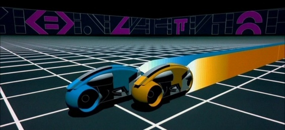

<meta charset="utf-8" emacsmode="-*- markdown -*-"><link rel="stylesheet" href="https://casual-effects.com/markdeep/latest/slate.css?">
**Trön Racing**
Dokumentation (Stand: 21.07.2021)


**Trön Racing** ist ein Computerspiel, welches im Rahmen der Vorlesung *Einführung in die Computergrafik und Visualisierung (BA-INF 105, Prof. Matthias Hullin)*
entworfen und unter Aufsicht der Tutoren *Julian Jungius* und *Lukas Sabatschus* in eigenständiger Arbeit entwickelt wurde.
Für die Entwicklung stand ein Zeitraum von 6 Wochen zur Verfügung.

Trön Racing ist Teil des Computer Animation Festivals 2021.

Bertan Karacora | Institut für Informatik, Universität Bonn | bertan.karacora@uni-bonn.de


Konzept
==============================================================
Vor Beginn der Implementation wurde ein grobes künstlerisches sowie ein technisches Konzept konzipiert, welches die Grundlage für die Umsetzung darstellte.

Setting
--------------------------------------------------------------
Als Inspirationsquelle dieses Projekts dient die Filmreihe *Tron* von Disney, das Original aus dem Jahre 1982,
welcher bis heute als Meilenstein in der Geschinchte der Computergrafik gefeiert wird und dessen Nachfolger *Tron: Legacy*,
der eine sehr viel modernere und optisch ansprechendere Umsetzung derselben Idee darstellt.
Das Setting des leuchtenden *Grids* mit den motorrad-ähnlichen sich bewegenden *Bikes* bietet gleichermaßen Möglichkeiten einer simplen zuverlässigen Gestaltung wie sie bereits 1982 möglich war
oder aber einer anspruchsvollen komplexen Szenerie. Die vielen leuchtenden Elemente und das Potential der schnellen Bewegungen im Setting eignen sich sehr gut für dieses Projekt.



Animation
--------------------------------------------------------------
Zu Beginn war geplant, ein Computerspiel mit einem steuerbaren Bike zu entwickeln. Das Spiel sollte dabei eingleitet werden,
von einer Kamerafahrt und einer Animation, bei der die Umgebung und das Gameplay in den Grundzügen vorgestellt werden.
Dazu sollte ein bereits fahrendes blaues Bike von oben herab gezeigt werden.
Nach einer Abwärtsbewegung der Kamera würden sich einige rote Bikes von hinten annähern und in einer Seitwärtsansicht in das Bild treten.
So wären bereits das zentrale blaue Bike, mit dem sich der Spieler hier identifizieren soll, sowie die Gegner des Spiels bekannt.
Wie im finalen Gameplay-Video zu sehen ist, wurde die Idee der einleitenden Kamerafahrt und Animation schließlich verworfen, um den Fokus mehr auf andere Aspekte zu legen, die auch bereits beim Gameplay zu erkennen sind.


Technische Umsetzung
--------------------------------------------------------------
Aus dem zum Projekt bereitgestellten Feature-Katalog sollten einige der folgenden Funktionen implemetiert werden:

Kategorie 0:
- Algorithmisch erzeugte (prozedurale) Geometrie
- Partikelsysteme

Kategorie 1:
- Bewegungsunsch¨arfe
- HDR-Effekte

Kategorie 2:
- Shadow Mapping
- Flächenlichtquellen
- Spherical Harmonics Illumination
- Weiche/Gefilterte Schatten

Kategorie 4:
- Interaktive Anwendung
- Sound - vielleicht sogar dynamisch nach Interaktion


Beschreibung
==============================================================
Große Teile der Implementierung erfüllen Zwecke des Debuggings und des praktischen Object Managements etc..
Im folgenden einige wesentliche Features in relativ chronologischer Reihenfolge ihrer Umsetzung.

Deferred Rendering Pipeline
--------------------------------------------------------------
Es wurde der Deferred Rendering Ansatz genutzt.

Neben der Normale und der Tiefe (aus der sich die Position schließlich rekonstruieren lässt) wird für jedes Fragment die Diffus-Farbe, die Spekularität,
die emittierte Farbe (für die ganzen emittierenden Elemnte im Tron Setting) sowie ein Wert für die Shininess gespeichert.
Die Shininess wird bei der Beleuchtung genutzt und aus ihr wird außerdem linear eine Metallicness dekodiert, welche die Intensität von Reflektionen bestimmt.

Im HDR Bloom Pass wird die gespeicherte Emitting-Textur verwendet.
Diese wird mithilfe eines Gauß-Kernels abwechselnd horizontal und vertikal verschmiert, sodass der Bloom-typische Blurring Effekt entsteht.
Hierbei wird zur Optimierung also die lineare Separierbarkeit eines solchen Kernels ausgenutzt.

Das Ergebnis wird zusammen mit den Daten aus dem GBuffer in den Lighting Pass gegeben, wo die Szene im Viewspace für jedes Licht berechnet wird.
Da das Blending der Resultate zu Problemen geführt hat, wird dies im abgegebenen Video nicht genutzt.
Schließlich werden die Screenspace Reflections hinzugefügt und ein Post-Processing durchgeführt.

************************************************************************************************************************************************************
*                     .---------------.                                 .----------------.           .---------------.      .----------------------------.
*                     | Geometry Pass +-------------------------------->| HDR Bloom Pass +---------->| Lighting Pass |----->| SSR + Post Processing Pass |
*                     '---------------'                                 '----------------'           '---------------'      '----------------------------'
*                                                                     
*                                                                  
*      .---------------------------------------------------------.     .-------------.    .-------------.    .--------------.                  .--------.
*      |                         GBuffer                         +---->| Ping Buffer |<-->| Pong Buffer |--->| Final Buffer |----------------->| Screen |
*      '----+--------------------+-------------------------+-----'     '-------------'    '-------------'    '---+------+---'                  '--------'
*           |                    |                         |                                                     |      ^
*           |                    |                         |                                                     |      |
* .---------+------.  .----------+---------.  .------------+---------.                                           +------+
* | Normal & Depth |  | Diffuse & Specular |  | Emitting & Shininess |                                Additive Blending for Lights
* '----------------'  '--------------------'  '----------------------' 
************************************************************************************************************************************************************


Das Grid
--------------------------------------------------------------
Zu Beginn der Entwicklung wurde das Grid mithilfe von GL_LINES gezeichnet.
Dies konnte mit prozeduraler Erzeugung von Vertices und geschicktem Indexing mit einigen for-Schleifen umgesetzt werden, sodass ein quadratisches Grid beliebiger Größe entstand.
Hierbei zeigte sich bereits das Größte Problem, das ein solches Grid mit leuter parallelen dünnen Linien mit sich bringt: Aliasing.

Um dem entgegen zu wirken, wurden einige Anti-Aliasing Techniken getestet. Multisampling stellte sich als große Herausforderung dar, da sich dies nicht mit dem Deferred Rendering Ansatz verträgt.
Nachdem dann scheinbar erfolgreich Multisampling angewendet werden konnte, zeigten sich Unterschiede in den 1-Pixel-breiten Linien, aber das Ergebnis war trotzdem noch von Aliasing betroffen.
Also wurde zusätzlich FXAA implemetiert, welches jedoch ebenso nicht erfolgreich war.

Schließlich war die Verbreiterung des Linien und ein gradieller Abstieg zur Rand der Grid-Linien hin eine erste Lösung.
In diesem Zuge wurde die Umsetzung mithilfe von GL_LINES verworfen und das Grid wurde stattdessen als prozedurale Textur auf eine Fläche gemapt.
Dies bedeutete, dass bei jeder Ecke ein Vertex hinzugefügt sein muss, aber auch, dass die Höhe irrelevant ist, wenn bei dem Mapping Längen- und Breitenkoordinaten verwendet werden.

Ein Algorithmus, der dies direkt im Fragment Shader umsetzt:

```````````````````````````````````````````````
const float edge_width = 1.0 / 32.0;

// grid.coord = position.xy;
vec2 uv = mod(grid_coord + edge_width, 1.0) - mod(grid_coord - edge_width, 1.0) - 2.0 * edge_width;
diffuse = vec3(tron_color * clamp(length(uv), 0.0, 1.0);
```````````````````````````````````````````````

Für Koordinaten, die auf dem Grid liegen, ergibt sich jeweils der Wert -1 (und eine Vektor-Länge von 1 für eine Grid-Kante oder sqrt(2) für eine Grid-Ecke) und sonst 0.
Nun konnte in Blender eine belibige 3D-Welt mit einem Grid-look designt werden, solange nur ganzzahlige xy-Koordinaten verwendet werden.

Am Ende wurde nach langer Recherche jedoch eine noch bessere Lösung gefunden, welche Screen-space partial derivatives nutzt:
[Anti-Aliased Grid Shader](http://madebyevan.com/shaders/grid/)

Die Gestaltung des Grids ließe sich in Blender noch sehr viel verbessern. Hierzu war jedoch keine Zeit mehr.

Bikes
--------------------------------------------------------------
Das Bike Model wurde nicht selbst entworfen. Beim Einladen der Bike-Daten zeigte sich, dass keine Textur nötig war, sondern verschiedene Materialien genutzt wurden,
um den Teilen des Bikes verschiedene Eigenschaften zu verleihen.
Dies wurde in einem eingene Shader für die Bikes umgesetzt, sodass diese Materialien Informationen übergeben werden, sodass Teile des Bikes leuchten und andere Teile schwarz und glatt spiegelnd erscheinen, während das Hauptgerüst, etwas matter und grau ist.
Bei Bedarf können die Bikes Tron-typisch rot oder blau gefärbt sein.
Der Lichtschweif der Tron-Bikes sollte durch prozedurale Geometrien umgesetzt werden, indem die letzte Position des Bikes genutzt wird, um ein Viereck an eine Kette anzuhängen. Für diese Feature war jedoch keine Zeit mehr.

Interaktion
--------------------------------------------------------------
Um das Bike zu steuern, wurde ein simples Geschwindigkeits-Modell konstruiert. Dieses berücksichtigt Beschleunigung durch Halten, automatische Verlangsamung und Lenkung durch Neigung.

```````````````````````````````````````````````
GLvoid moto::updateMoto() {
	state->translate += glm::vec3(slide_speed * state->y_rotation_angle / max_angle, move_speed * state->speed / max_speed, 0.0);

	// Borders
	if (state->translate.x >= 9.5) state->translate.x = 9.5;
	if (state->translate.x <= -9.5) state->translate.x = -9.5;

	// Reset loop
	if (state->translate.y >= 200.0) state->translate.y -= 200.0;

	state->speed -= state->speed * brake_factor;
	state->y_rotation_angle -= state->y_rotation_angle * straight_factor;

	if (state->w_down && state->speed < max_speed) state->speed += forward_acceleration;
	if (state->s_down && state->speed >= 0.0) state->speed -= reversed_acceleration;
	if (state->a_down && state->y_rotation_angle < max_angle) state->y_rotation_angle -= rotation_speed;
	if (state->d_down && state->y_rotation_angle > -max_angle) state->y_rotation_angle += rotation_speed;

	glm::mat4 translation_mat = glm::translate(glm::mat4(1.0), state->translate);
	glm::translate(translation_mat, glm::vec3(0.0, -1.0, 0.0)); //camera to front
	glm::mat4 rotation_mat = glm::rotate(glm::mat4(1.0), glm::radians(state->y_rotation_angle), glm::vec3(0.0, 1.0, 0.0));
	glm::mat4 scale_mat = glm::scale(glm::mat4(1.0), glm::vec3(state->scale));

	state->model_mat = translation_mat * rotation_mat * scale_mat;
}
```````````````````````````````````````````````

Post-Processing
--------------------------------------------------------------
Das Post-Processing beinhaltet:
-[HDR Reinhard Tone Mapping](https://www.shadertoy.com/view/WdjSW3) (besonders effektiv, da Bloom verwendet wurde)
-Nebel in der Ferne
-Gamma Korrektur

Screenspace Reflections
--------------------------------------------------------------
Passend zur Deferred Rendering Pipeline wurden Screenspace Reflection durch Raymarching auf der GPU eingesetzt, wie es im Video zu sehen ist. Binäre Suche präzisiert das Raymarching im Fragment Shader. So kann sich das Grid auf den Flächen des Bikes spiegeln und das Bike sowie die steilen Ränder der Szene auf dem Boden des Grids.

Beleuchtung
--------------------------------------------------------------
Zur Beleuchtung wurde eine Phong-BRDF genutzt. Der Deferred Rendering Ansatz ermöglicht eine effiziente Verwendung einer großen Anzahl von Lichtquellen, dies konnte jedoch nicht implementiert werden.
Es wurde versucht, die Szene mit jeweils einem verschiedenen Lichtpunkt zu rendern und die Ergebnisse additiv übereinander zu blenden, dies war aber bis zum Schluss nicht erfolgreich.

Sound
--------------------------------------------------------------
Um Sound in der Anwendung abspielen zu können, wurde die Library [IrrKlang](https://www.ambiera.com/irrklang/) eingebunden.
Anschließend wurde -inspiriert von den Akkorden des Tron Lagacy Soundtracks - eine improvisierter Song auf dem Klavier aufgenommen.


Steuerung
==============================================================
Kamera - Maus (rechte Taste gedrückt halten)

Bewegung - WASD

Musik - M

Verlassen - Esc


Ergebnis
==============================================================

[](https://www.youtube.com/watch?v=pUJhhdyEusw)


Referenzen
==============================================================
[Tron Bike Model von SDC](https://sketchfab.com/3d-models/tron-moto-low-poly-sdc-free-e9b610ca2102447e90fff73ed85778b6)

[IrrKlang](https://www.ambiera.com/irrklang/)

[Reinhard Tone Mapping](https://www.shadertoy.com/view/WdjSW3)

 
<style class="fallback">body{visibility:hidden}</style><script>markdeepOptions={tocStyle:'long'};</script>
<!-- Markdeep: -->
<script src="https://casual-effects.com/markdeep/latest/markdeep.min.js?" charset="utf-8"></script>
